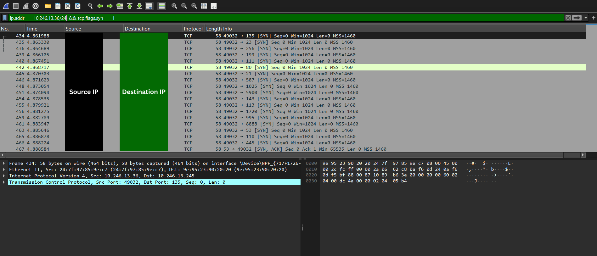

# Yash-Walhekar-Cyber-Task-1
Network scan and analysis for Elevate Labs internship task 1

# Cyber Security Internship: Task 1 - Network Port Scan

## 1. Objective

In this case, the task was to perform network reconnaissance in a local network using Nmap. The task in this case was to determine the active hosts, the ports available and the potential security risk of running services.

## 2. Methodology and Execution

The task was completed by following a systematic process:
1. **Tool Installation:** Nmap was installed as the significant tool to be applied in port scanning.
2. **Network Identification:** The scan target was classified on local IP range.
3. **Scan Execution:**  Nmap Scan was used to perform a TCP SYN scan (-sS). This stealth scan works appropriately as it does not experience full TCP hand shake. The command used was:
    ```bash
    nmap -sS -oN nmap_results.txt LOCAL_NETWORK_RANGE
    ```
4. **Analysis:** The output has been examined in order to identify services and assess risks.

## 3. Sanitized Scan Results

The scan involved two active hosts. Privacy and security are ensured by anonymizing all IP addresses. The following are the results:

| Anonymized Host | Open Ports                               | Inferred OS / Device Type | Notes                                      |
| --------------- | ---------------------------------------- | ------------------------- | ------------------------------------------ |
| `Host 1`     | `53/tcp` (DNS)                           | Router or DNS Server      | Normal port of network DNS resolution.  |
| `Host 2`    | `135/tcp` (msrpc) <br> `139/tcp` (netbios-ssn) <br> `445/tcp` (microsoft-ds) | Windows Machine           |The ports indicate running services of file/printer sharing (SMB). |

---

## 4. Security Analysis and Recommendations

The research focused on the services running in **`Host 2`**,which has a potential attack surface.

* **Identified Risk:** Server Message Block (SMB) on port 445/tcp is among the enormous sources of network attacks when it is not secured accordingly. Such SMB weaknesses have been exploited in the past using popular ransomware like WannaCry.

* **Recommendations to Secure the Open Ports:**
    * **Implement a Firewall:** Host-based type of firewall should also be installed to permit blocked ports of `135`, `139`, and `445`. Only trusted IP addresses should be made to connecting the local network.
    * **Apply Security Patches:** Windows operating system must always be patched with the latest security patches to eliminate the vulnerabilities that are well known.
    * **Disable Legacy Protocols:** Do not use NetBIOS over TCP/IP unless you need to use it.

## 5. Wireshark Analysis

Wireshark is also used to capture the network traffic generated during the scan together with the Nmap scan. This gives a more in depth, packet level understanding of the way Nmap is able to decide whether a port is open.

* **Operation:** A TCP SYN scan was executed as the Wireshark packets were snortied.
* **Analysis:** The filtering of the capture was used to indicate the TCP packets that had the SYN flag. As it can be observed in the screenshot, the scanning machine (YOURPCIP) transmits a sequence of [SYN] packets to the target (ROUTER_IP) on different ports.
* **Finding:** The target replies with an open port (port 53) [SYN] packet containing an ACK packet. It is this SYN, ACK response which is, in fact, how Nmap reports an open port and proves the accuracy of the scan.  


